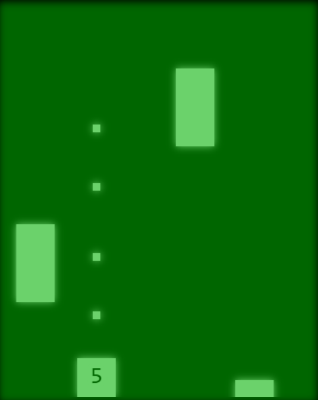

# Übung 4 - Canvas #

Starter Code:
* **[FallingStones.js](./src/js/games/FallingStones.js)**

GameEngine usw:
* **[GameEngine.js](./src/js/GameEngine.js)** (Kümmert sich um Eingaben und Spielauswahl)
* **[GameTemplate.js](./src/js/games/GameTemplate.js)** (Parent Klasse für alle Games)
* **[GameObject.js](./src/js/GameObject.js)** (nützliche Objekte)

Andere Spiele in der GameBox: 
* **[TestGame](./src/js/games/TestGame.js)**
* **[Pong](./src/js/games/pong/Pong.js)**
* **[Snake](./src/js/games/snake/Snake.js)**

## 00 Vorbereitung ##

* Wechselt zum Git Branch der gestrigen Übung und erstellt daruaf basierend einen neuen Branch für die heutige Übung. z.B. `Ü4-bearbeitung`
* So stellen wir sicher dass ihr euren schönen Skin von gestern weiter benutzen könnt. (**[index.js](./src/js/index.js)** skins Liste ändern!)

## 01 Code Verständnis ##

Lest den Code von **[TestGame](./src/js/games/TestGame.js)**, **[Pong](./src/js/games/pong/Pong.js)** und **[Snake](./src/js/games/snake/Snake.js)** an und schaut euch an wie die Spiele **[GameTemplate](./src/js/games/GameTemplate.js)** erweitern und wie sie **[Game Objekte](./src/js/GameObject.js)** hernehmen.

Stellt euch diese Fragen: 
* Was unterscheidet den Programmablauf von Pong grundsätzlich von Snake?
* Warum ist für `Snake` und `Pong` kein Konstruktor definiert?
* Warum benutzt Snake keine Kollisionsabfragen?
* Warum macht es Sinn auf `keydown` bzw `keyup` events zu reagieren anstatt `keypress`?
* Wo sind die Tastenbelegungen (WASD, QE, etc) festgelegt, und wo werden sie angewendet? 
* Wo wird eigentlich `this.maxBallSpeed` in Pong gesetzt?
* Warum brauchen wir `this.maxBallSpeed` überhaupt?
* Wie erhöht man die Geschwindigkeit der Schlange in Snake?
* Warum müssen `update` und `draw` Aufrufe den Canvaskontext `ctx` erhalten?

## 02 Falling Stones ##

Eure heutige Aufgabe ist es das Spiel **[FallingStones](./src/js/games/FallingStones.js)** zu implementieren.

Das Spiel beinhaltet Drei Objekttypen:
* Der Spieler: ein 50x50 großer Block der sich am unteren Bildrand hin und her bewegen kann
* Die Steine: 50x100 große Blöcke dir vom oberen Rand des Spielfelds zum unteren fallen
* Projektile: 10x10 große Blöcke mit denen der Spieler auf die Steine schießen kann, diese fliegen von unten nach oben

Spielregeln:
* Wenn ein Stein das Spielfeld am unteren Rand verlässt verliert der Spieler ein Leben
* Wenn ein Projektil einen Stein trifft werden beide zerstört

Denkanstöße:
* müssen alle Steine überprüfen ob sie das Spielfeld verlassen haben?
* Wann müssen Projektile prüfen ob sie Steine treffen?

### 02.1 Geerbte Funktionen ###

FallingStones erbt von GameTemplate (`class FallingStones extends GameTemplate`).
Jede Klasse die von **[GameTemplate](./src/js/games/GameTemplate.js)** erbt, hat damit auch alle Methoden die in **[GameTemplate](./src/js/games/GameTemplate.js)** definiert sind.
Einige dieser Funktionen benutzen wir ohne Veränderung, andere müssen wir in **[FallingStones.js](./src/js/games/FallingStones.js)** überschreiben.

Erstelle die Funktionen:
* `start()` (setzt darin `this.gameOver=false`)
* `bindControls()` 
* `update(ctx)`
* `draw(ctx)`

### 02.2 Der Spieler ###

Erstelle in `start()` ein Spielerobjekt `this.player`, wähle und importiere hierfür ein passendes Objekt aus einem anderen Spiel. **Es ist keine Erweiterung dieses Objekts nötig wenn ihr korrekt wählt**
Das Spielerobjekt ist am unteren Rand zentral auf dem Bildschirm positioniert. (Wenn ihr die y-Koordinate jedoch genau auf den unteren Rand setzt steht das Objekt aus dem Bild heraus und ihr seht es nicht!)

Zeichne in `draw()` den Spieler um das Objekt auf dem Canvas anzuzeigen. (`this.player.draw(ctx)`)

### 02.3 Da passiert was ###

Der Spieler soll sich auch bewegen können.

Füge in `input()` einen `switch` hinzu der die Eingaben mit den Bewegungen des Spielerobjekts verknüpft.
* `INPUT.LEFT` nach links
* `INPUT.RIGHT` nach rechts

Aktualisiere in `update` den Zustand des Spielers um Bewegung zu ermöglichen. (`this.player.update(ctx)`)

### 02.4 pew pew pew ###

Erstelle in `start()` das leere Array `this.bullets`.
Füge **FallingStones** eine Funktion `createBullet()` hinzu die ein Projektil an der Position des Spielers erzeugt und dies `this.bullets` hinzufügt. Auch für Projektile könnt ihr vorhandene Klassen verwenden.
Füge einen Eintrag in `input()` hinzu der `INPUT.UP` mit dieser Funktion verknüpft.

Füge **FallingStones** eine Funktion `updateBullets()` hinzu die von `update()` aufgerufen wird.
Funktionalitäten:
* updated alle vorhandenen Projektile
* überprüft ob Projektile das Spielfeld verlassen haben und entfernt sie aus `this.bullets`

Erweitere `draw()` um den inhalt des `this.bullets` Arrays zu zeichnen.

### 02.5 Solange uns nicht der Himmel auf den Kopf fällt ###

Füge in `start()` das leere Array `this.stones` hinzu.
Füge **FallingStones** eine Funktion hinzu die von `update` aufgerufen wird.
Funktionalitäten:
* Erstellt in regelmäßigen Abständen am oberen Rand an zufälligen x-Koordinaten neue Steine ([Math.random()](https://developer.mozilla.org/de/docs/Web/JavaScript/Reference/Global_Objects/Math/random))
* updated alle vorhandenen Steine
* überprüft ob Steine das Spielfeld verlassen haben und entfernt sie aus `this.stones`

Erweitere `draw()` um den inhalt des `this.stones` Arrays zu zeichnen.

### 02.6 pew pew pew? ###

Erweitere die Funktion, die die Projektile aktualisiert
Funktionalität:
* Wenn ein Projektil einen Stein trifft, werden beide zerstört
* Verhindere Dauerfeuer, ein Schuss soll eine bestimmte Zeit nach dem letzten Schuss nicht möglich sein (vgl. FpsControl in Snake)

### 02.7 High Score! ###

Erstelle in `start()` die Variablen `this.points` und `this.life`
Überschreibe den geerbten Getter `gameOverText` um zusätzlich auch die Punkte anzeigen zu könne.

Erweitere deine bestehenden Funktionen:
* Ein Stein der erfolgreich das Spielfeld verlässt zieht eine Leben ab
* Ein Stein der erfolgreich zerstört wird gibt eine Punkt
* Wenn das Leben auf `0` sinkt rufe `this.end()` auf
* Der Aktuelle Wert von `this.life` wird an der Position des Spielerobjekts angezeigt (`ctx.fillText(...)` verwenden)

### 02.8 (BONUS) Schwierigkeiten ###

Definiere in `MODES` drei Schwierigkeiten für **[FallingStones](./src/js/games/FallingStones.js)** die die Initialwerte des Spiels sinnvoll anpassen um es leichter oder schwieriger zu machen.
(vgl. **[Pong](./src/js/games/pong/Pong.js)**)

### 02.9 (BONUS) *Difficulty intesifies*

Erweitere das Spiel damit es zunehmend schwieriger wird wenn der Spieler mehr Punkte erreicht.
Ob und wie schnell es schwieriger wird ist natürlich wieder in den `MODES` definiert

## 03 Projekt ##

Macht euch Gedanken was ihr im Projekt machen wollt.
Schreibt Ideen auf und sprecht mich darauf an.

